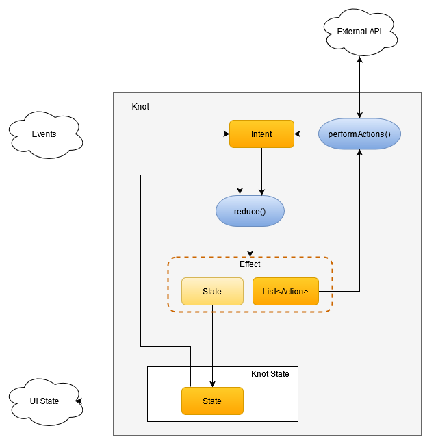
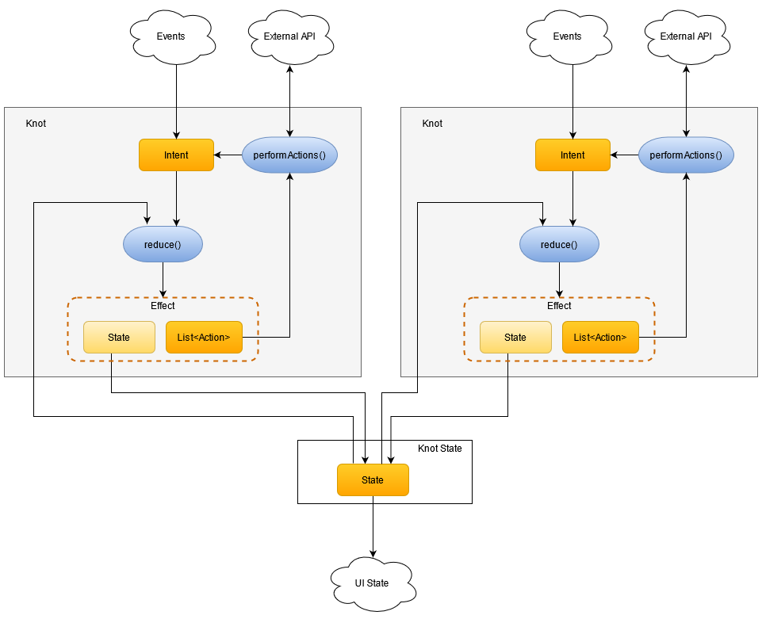

[](http://www.apache.org/licenses/LICENSE-2.0)

# Reduce

Concise reactive state container library for Android applications based on Kotlin coroutines.

# Inspiration
Reduce was inspired by awesome project
* Knot https://github.com/beworker/knot

But it is written for RxJava. I decided to write it based on Kotlin corutines.

# Concept

Reduce helps managing application state by reacting on events and performing asynchronous actions in a structured way. There are five core concepts Knot defines: `State`, `Intent`, `Action`, `Reducer` and `Effect`.



`State` represents an immutable state of an application. It can be a state of a screen or a state of an internal statefull headless component.

`Intent` is an immutable data object with an optional payload intended for changing the `State`. A `Intent` can be produced from an external source or be a result of execution of an `Action`.

`Action` is a synchronous or an asynchronous operation which, when completed, can – but doesn't have to – emit a new `Intent`.

`Reducer` is a function that takes the previous `State` and a `Intent` as arguments and returns the new `State` and an optional `Action`s wrapped by the `Effect` class. `Reducer` in Knot is designed to stay side-effects free because each side-effect can be turned into an `Action` and returned from the reducer function together with a new state in a pure way.

`Effect` is a convenient wrapper class containing the new `State` and a list of `Action`s. If list of `Action`s is not empty, Knot will perform it and provide resulting `Intent` (if any) back to the `Reducer`.

# Getting Started

The example below declares a Knot capable of loading data, handling *Success* and *Failure* loading results and reloading data automatically when an external *"data changed"* signal gets received. It also logs all `State` mutations as well as all processed `Intents` and `Actions` in console.

```kotlin
sealed class BooksState : State {
    object Empty : BooksState()
    object Loading : BooksState()
    data class Content(val books: List<Book>) : BooksState()
    data class BooksError(val message: String) : BooksState()
}

sealed class BooksIntent : Intent {
    object Load : BooksIntent()
    class Success(val books: List<Book>) : BooksIntent()
    class Failure(val message: String) : BooksIntent()
}

sealed class BooksAction : Action {
    object Load : BooksAction()
}

val knot = knot<BooksState, BooksIntent, BooksAction> {

    initialState = BooksState.Empty

    intents { intent ->
            when (intent) {
                BooksIntent.Load -> when (this) {
                    BooksState.Empty,
                    is BooksState.Content,
                    is BooksState.BooksError -> BooksState.Loading + BooksAction.Load
                    else -> stateOnly
                }
                is BooksIntent.Success -> when (this) {
                    BooksState.Loading -> BooksState.Content(intent.books).stateOnly
                    else -> unexpected(intent)
                }
                is BooksIntent.Failure ->  when (this) {
                    BooksState.Loading -> BooksState.BooksError(intent.message).stateOnly
                    else -> unexpected(intent)
                }
            }
        }

        actions { action ->
            when (action) {
                BooksAction.Load -> {
                    repository.loadBooks().toChange()
                }
            }
        }
}
```

Notice how inside the `reduce` function a new `State` can be combined with an `Action` using `+` operator. If only the `State` value should be returned from the reducer, the `.stateOnly` suffix is added to the `State`.

# Composition

If your knot becomes complex and you want to improve its readability and maintainability, you may consider to write a composite knot. You start composition by grouping related functionality into, in a certain sense, indecomposable pieces called `Delegates`. Each `Delegate` is isolated from the other `Delegates`. It defines its own set of `Intents`, `Actions` and `Reducers`. It's only the `State`, what is shared between the `Delegates`. In that respect each `Delegate` can be seen as a separate `Knot` working on a shared `State`.



```kotlin
    private val commonState = CoroutineKnotState<BooksState>(BooksState.Empty)

    private val clearKnot =
        knot<BooksState, ClearBookIntent, ClearBooksAction> {

            knotState = commonState

            intents { intent ->
                when (intent) {
                    ClearBookIntent.Clear -> when (this) {
                        is BooksState.Content -> BooksState.Empty.stateOnly
                        is BooksState.Empty -> stateOnly
                        else -> unexpected(intent)
                    }
                }
            }
        }

    private val loadKnot = knot<BooksState, BooksIntent, BooksAction> {

        knotState = commonState

        intents { intent ->
            when (intent) {
                BooksIntent.Load -> when (this) {
                    BooksState.Empty,
                    is BooksState.Content,
                    is BooksState.BooksError -> BooksState.Loading + BooksAction.Load
                    else -> stateOnly
                }
                is BooksIntent.Success -> when (this) {
                    BooksState.Loading -> BooksState.Content(intent.books).stateOnly
                    else -> unexpected(intent)
                }
                is BooksIntent.Failure ->  when (this) {
                    BooksState.Loading -> BooksState.BooksError(intent.message).stateOnly
                    else -> unexpected(intent)
                }
            }
        }

        actions { action ->
            when (action) {
                BooksAction.Load -> {
                    repository.loadBooks().toChange()
                }
            }
        }
    }
```


# Why Reduce?

* Predictable - state is the single source of truth.
* Side-effect free reducer - by design.
* Scalable - single knots can be combined together to build more complex application logic.
* Composable - complex knots can be composed out of delegates grouped by related functionality.
* Structured - easy to read and write DSL for writing better structured and less buggy code.
* Concise - it has minimalistic API and compact implementation.
* Testable - reducers and transformers are easy to test.
* Why not?

# License
```
Copyright 2021 Gennadiy Kuchergin

Licensed under the Apache License, Version 2.0 (the "License");
you may not use this file except in compliance with the License.
You may obtain a copy of the License at

   http://www.apache.org/licenses/LICENSE-2.0

Unless required by applicable law or agreed to in writing, software
distributed under the License is distributed on an "AS IS" BASIS,
WITHOUT WARRANTIES OR CONDITIONS OF ANY KIND, either express or implied.
See the License for the specific language governing permissions and
limitations under the License.
```
