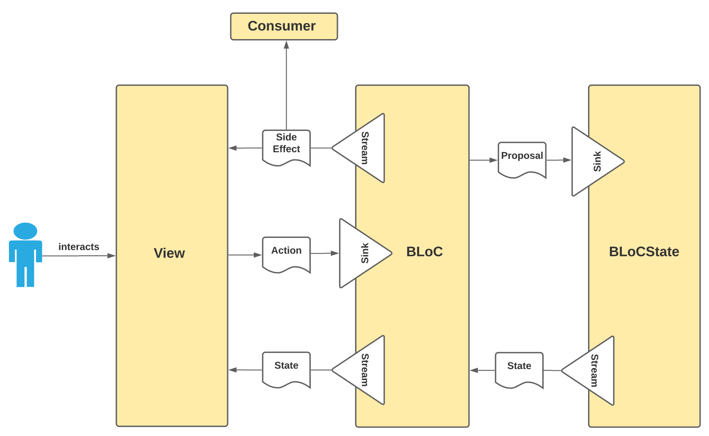

[](http://www.apache.org/licenses/LICENSE-2.0)

# Kotlin BLoC Framework



Concise ui framework for Kotlin Multiplatform Mobile.

# Inspiration
Reduce was inspired by :
* Knot
* Decompose
* Orbit
* KotlinMVI
* React Redux

# Concept


# Getting Started

The example below declares a Knot capable of loading data, handling *Success* and *Failure* loading results and reloading data automatically when an external *"data changed"* signal gets received. It also logs all `State` mutations as well as all processed `Intents` and `Actions` in console.

```kotlin
```

# Composition

```kotlin
```

# Scalability

```kotlin
```

# Simplify

```kotlin
```

# Gradle

**Step 1.** Add the JitPack repository to your build file.
Add it in your root build.gradle at the end of repositories:
```kotlin
allprojects {
    repositories {
        ...
        maven("https://jitpack.io")
    }
}
```
**Step 2.** Add the dependency
```kotlin
dependencies {
}
```

# Why Kotlin BLoC?

* Why not?

# License
```
Copyright 2022 Emanuel Moecklin

Licensed under the Apache License, Version 2.0 (the "License");
you may not use this file except in compliance with the License.
You may obtain a copy of the License at

   http://www.apache.org/licenses/LICENSE-2.0

Unless required by applicable law or agreed to in writing, software
distributed under the License is distributed on an "AS IS" BASIS,
WITHOUT WARRANTIES OR CONDITIONS OF ANY KIND, either express or implied.
See the License for the specific language governing permissions and
limitations under the License.
```
