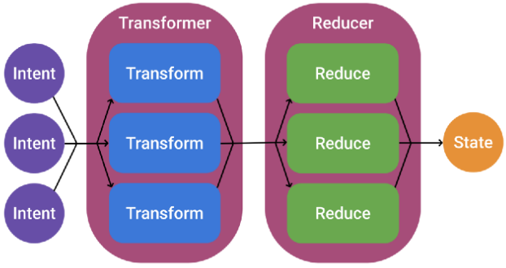
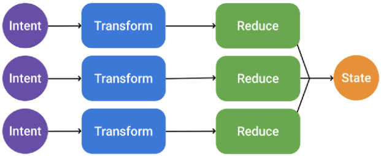

## Motivation

In [A Matter of Taste](../bloc/reducer#a-matter-of-taste) we discussed two different styles to define reducers (catch-all vs single-action reducers). In this chapter we take the idea of single-action reducers one step further. To recap, this is what we have so far:

```kotlin
bloc<Int, Action>(context, 1) {
    reduce<Increment> { state + 1 }
    reduce<Decrement> { state - 1 }

    // vs.
    
    reduce {
        when(action) {
            is Increment -> state + 1
            else -> state -1
        }
    }
}
```

The idea of `BlocOwners` was inspired by the [Orbit](https://orbit-mvi.org/) framework which has the concept of a `ContainerHost` used for classes that want to launch Orbit `intents`. Here's an example:

```kotlin
class CalculatorViewModel: ContainerHost<CalculatorState, CalculatorSideEffect>, ViewModel() {

    override val container = container<CalculatorState, CalculatorSideEffect>(CalculatorState())

    fun add(number: Int) = intent {
        postSideEffect(CalculatorSideEffect.Toast("Adding $number to ${state.total}!"))

        reduce {
            state.copy(total = state.total + number)
        }
    }
}
```

The `ContainerHost` concept is an iteration over the MVI model, enabling us to define the intent / business logic wherever we want. The author of the framework compares the Redux style vs. the MVVM+ style (that's what he calls the Orbit approach) of implementing MVI in [this article](https://appmattus.medium.com/top-android-mvi-libraries-in-2021-de1afe890f27). The following two diagrams summarize the two styles nicely.

### Redux Style


Intents are represented by objects, piped through a stream into a transformer and reducer, which produces a single state output.


### MVVM+ Style


Intents here have their own transformer and reducer (a function) before being combined into the single state output.

## BlocOwner

A `BlocOwner` in `Kotlin Bloc` is the equivalent of an Orbit `ContainerHost`. It's an interface that can be implemented by any class and has a `Bloc`:

```kotlin
public interface BlocOwner<out State : Any, in Action : Any, SideEffect : Any, Proposal : Any> {

    public val bloc: Bloc<State, Action, SideEffect>

}
```

Extension functions give the `BlocOwner` the "power" to define initializers, reducers, thunks and side effects. The syntax is even simpler than with Orbit (which requires to wrap everything in an `intent` statement before `reduce`, `postSideEffect` and `repeatOnSubscription` can be used):

```kotlin
class PostListViewModel(context: ActivityBlocContext) : ViewModel(),
    BlocOwner<PostsState, Nothing, Posts.OpenPost, PostsState>,
    KoinComponent {

    private val repository = getKoinInstance<PostRepository>()

    override val bloc = bloc<PostsState, Nothing, Posts.OpenPost, PostsState>(
        blocContext(context),
        blocState(PostsState())
    )

    init {
        onCreate {
            if (state.isEmpty()) {
                loading()
                loaded(repository.getOverviews())
            }
        }
    }

    private fun loading() = reduce {
        state.copy(loading = true)
    }

    private fun loaded(posts: List<Post>) = reduce {
        state.copy(loading = false, posts = posts)
    }

    fun onPostClicked(post: Post) = sideEffect {
        Posts.OpenPost(post)
    }
}
```

In above example an Android ViewModel implements the `BlocOwner` interface but any class can implement it to use the "MVVM+ syntax". As a matter of fact with [Extensions](../../extensions/overview), you could put the business logic into an Android Activity and still retain state across configuration changes (of course you'd do that only for simple applications):

```kotlin
class CounterActivity : AppCompatActivity(), BlocOwner<Int, Int, Unit, Int> {

    override val bloc by getOrCreate { bloc<Int, Int>(it, 1) }

    private fun increment() = reduce { state + 1 }
    
    private fun decrement() = reduce { state - 1 }

    override fun onCreate(savedInstanceState: Bundle?) {
        setContent {
            val state by bloc.observeState()            
            
            // here goes the view declaration
        }
    }
```

:::tip
Reducers are always processed sequentially regardless whether they were triggered by an action (Redux style) or by a function (MVVM+ style). See also [Concurrency](../bloc/reducer.md#concurrency).
:::