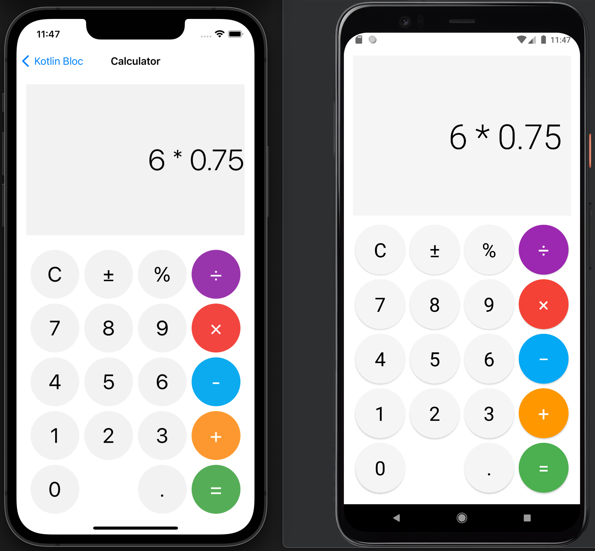

## Calculator



The two calculator sample apps (adapted from [Orbit](https://orbit-mvi.org)) demonstrate:

- how to use `Blocs` in iOS
- how to use `Blocs` with or without Android ViewModel
- how to use [data binding](https://developer.android.com/topic/libraries/data-binding) with `Blocs` on Android
- how to use sealed classes or enums classes as `Action`

### Calculator 1

The more conventional implementation uses a sealed class as Action:

```kotlin
sealed class CalculatorAction {
    object Clear : CalculatorAction()
    object Add : CalculatorAction()
    data class Digit(val digit: Int) : CalculatorAction()
   // more actions ...
}
```

which are processed using single-action reducers:

```kotlin
fun bloc(context: BlocContext) = bloc<CalculatorState, CalculatorAction>(context, CalculatorState()) {
    reduce<Clear> { CalculatorState() }
    reduce<Add> { state.resetErrors().apply(Operator.Add) }
    reduce<Digit> { state.resetErrors().digit(action.digit) }
    // more reducers...
```

#### Android

On Android `toLiveData()` converts the `StateStream` to [LiveData](https://developer.android.com/topic/libraries/architecture/livedata) so it can be bound to the view using data binding:

```kotlin
class CalculatorViewModel : ViewModel() {

    private val bloc = bloc(blocContext())

    val state = toLiveData(bloc)
```

```xml
<data>
  <variable
    name="viewmodel"
    type="com.onegravity.bloc.calculator.CalculatorViewModel" />
</data>

<!-- display State -->
<TextView
  android:text="@{viewmodel.state.toString()}"/>

<!-- send an Action -->
<Button
  android:onClick="@{(view) -> viewmodel.button(view.id)}"/>
```

#### iOS

On iOS the standard [BlocHolder](../extensions/ios/bloc_holder.md)/ [BlocObserver](../extensions/ios/bloc_observer.md) pattern is used:

```swift
struct CalculatorView: View {
    private let holder = BlocHolder { CalculatorKt.bloc(context: $0) }
    
    @ObservedObject
    private var model: BlocObserver<CalculatorState, CalculatorAction, KotlinUnit>

    init() {
        self.model = BlocObserver(self.holder.value)
    }

    var body: some View {

      // ...
        
      // display State
      Text("\(model.value)")

      // ...

      Button(action: {
        // send an Action
        holder.value.send(value: CalculatorAction.Clear())
      }) {
        Text("Clear")
      }
```

### Calculator 2

The second calculator uses enum classes as `Action`:

```kotlin
enum class ActionEnum(val digit: Int? = null) {
    Clear,
    Add,
    Digit0(0),
    Digit1(1),
    // more actions...
}
```

which are also processed using single-action reducers but with a slightly different syntax:
```kotlin
fun blocEnum(context: BlocContext) = bloc<CalculatorState, ActionEnum>(context, CalculatorState()) {
  reduce(ActionEnum.Clear) { CalculatorState() }
  reduce(ActionEnum.Add) { state.resetErrors().apply(Operator.Add) }
  reduce(ActionEnum.Subtract) { state.resetErrors().apply(Operator.Subtract) }
// more reducers...
```

#### Android

On Android the `Bloc` is created in the Activity itself, eliminating the ViewModel (at least on the surface):

```kotlin
class CalculatorActivity : AppCompatActivity() {
    val bloc by getOrCreate { calculatorBloc(it) }

    val state by lazy { toLiveData(bloc) }

    override fun onCreate(savedInstanceState: Bundle?) {
        super.onCreate(savedInstanceState)

        bind<ActivityCalculatorNoVmBinding>(R.layout.activity_calculator_no_vm) { it.activity = this }
    }

    fun button(action: ActionEnum) {
        bloc.send(action)
    }
}
```

```xml
<data>
    <variable
        name="activity"
        type="com.onegravity.bloc.calculator.CalculatorActivity" />
    <import type="com.onegravity.bloc.sample.calculator.ActionEnum" />
</data>

<!-- display State -->
<TextView
  android:text="@{activity.state.toString()}"/>

<!-- send an Action -->
<Button
  android:onClick="@{() -> activity.button(ActionEnum.Clear)}"/>
```

#### iOS

There's no implementation on iOS side but if there were, it would look very similar to the first implementation:


```swift
struct CalculatorView: View {
    private let holder = BlocHolder { CalculatorEnumsKt.blocEnum(context: $0) }
    
    @ObservedObject
    private var model: BlocObserver<CalculatorState, ActionEnum, KotlinUnit>

    init() {
        self.model = BlocObserver(self.holder.value)
    }

    var body: some View {
      // ...
        
      // display State
      Text("\(model.value)")

      // ...

      Button(action: {
        // send an Action
        holder.value.send(value: ActionEnum.clear)
      }) {
        Text("Clear")
      }
```
