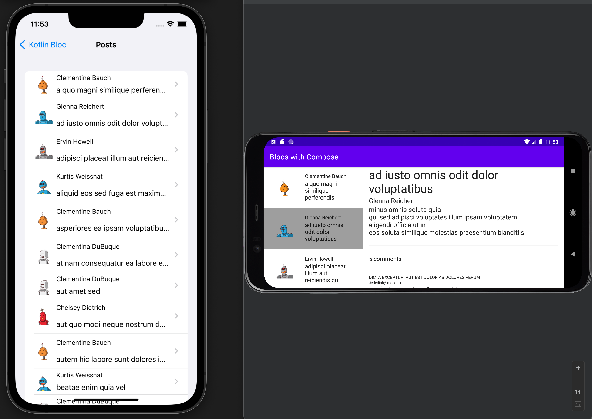

## Posts



The two posts sample apps are also adapted from [Orbit](https://orbit-mvi.org). They demonstrate:

- how to implement a dual pane layout
- how to run more complex asynchronous operations (this time real ones) with loading spinners and error handling
- how to use initializers
- how to use side effects
- how to combine Redux and `BlocOwner` / MVVM+ syntax
- how to use Blocs with Fragments on Android
- how to define a contract for the view component

### Posts 1

The [first example app](https://github.com/1gravity/Kotlin-Bloc/tree/master/bloc-samples/src/commonMain/kotlin/com/onegravity/bloc/sample/posts/bloc) uses two different `Blocs` with separate `BlocStates`. 

```kotlin
data class PostsState(
    val loading: Boolean = false,
    val posts: Result<List<Post>, Throwable> = Ok(emptyList()),
)

object Posts {
    // the Action class
    sealed class Action {
        object Load : Action()
        object Loading : Action()
        data class Loaded(val posts: Result<List<Post>, Throwable>) : Action()
        data class Clicked(val post: Post) : Action()
    }

    // the SideEffect class
    class OpenPost(val post: Post)

    fun bloc(context: BlocContext) = bloc<PostsState, Action, OpenPost, PostsState>(
        context,
        blocState(PostsState())
    ) {
        val repository = getKoinInstance<PostRepository>()

        // start loading the posts in the initializer
        onCreate { 
          if (state.isEmpty()) dispatch(Action.Load) 
        }

        // we could also put the thunk code into the onCreate block 
        // but we want to illustrate the use of thunks
        thunk<Action.Load> {
            dispatch(Action.Loading)
            val result = repository.getOverviews()
            dispatch(Action.Loaded(result))
        }

        // this is an anti-pattern according to 
        // https://medium.com/androiddevelopers/viewmodel-one-off-event-antipatterns-16a1da869b95
        // but we're doing it anyway
        sideEffect<Action.Clicked> { OpenPost(action.post) }

        reduce<Action.Loading> { 
          state.copy(loading = true) 
        }

        reduce<Action.Loaded> {
            state.copy(loading = false, posts = action.posts)
        }
    }
}
```

#### Android

The original sample app in [Orbit](https://orbit-mvi.org) uses a ViewModel and a Fragment but `Kotlin Bloc` eliminates the need for a ViewModel:

```kotlin
class PostsFragment : 
    Fragment(R.layout.post_list_fragment),
    BlocOwner<PostsState, Posts.Action, Posts.OpenPost, PostsState> {

    override val bloc by getOrCreate("posts") { Posts.bloc(it) }

    override fun onResume() {
        super.onResume()
        
        // subscribe to the state and the side effects
        subscribe(this, ::render, ::sideEffect)
    }

    private fun render(state: PostsState) {
        // render the view
    }

    private fun sideEffect(sideEffect: Posts.OpenPost) {
        // navigate to the detail view using a side effect
        findNavController().navigate(
            PostsFragmentDirections.actionListFragmentToDetailFragment(
                sideEffect.post
            )
        )
    }
```

:::tip
The bloc in above example is created using the key "posts":
```kotlin
override val bloc by getOrCreate("posts") { Posts.bloc(it) }
```
[Activity/Fragment](../extensions/android/bloc_context.md#activityfragment) explains in detail why we need that key.
:::

#### iOS

There's no iOS implementation for the first posts example.

### Posts 2

The [second example app](https://github.com/1gravity/Kotlin-Bloc/tree/master/bloc-samples/src/commonMain/kotlin/com/onegravity/bloc/sample/posts/compose) uses a single bloc for the master and the details view/component and defines a contract between the view and the bloc to use function calls instead of actions:

```kotlin
abstract class PostsComponent : BlocOwner<PostsRootState, PostsAction, Unit, PostsRootState> {
    // we need this for iOS to prevent erasure of generic types
    abstract override val bloc: Bloc<PostsRootState, PostsAction, Unit>

    abstract fun onSelected(post: Post)
    abstract fun onClosed()
}
```

The implementing PostsComponent class is pretty straight forward:


```kotlin
sealed class PostsAction

class PostsComponentImpl(context: BlocContext) : PostsComponent() {

    // internal actions, not exposed to the View
    private object PostsLoading : PostsAction()
    private data class PostsLoaded(val result: Result<List<Post>, Throwable>) : PostsAction()
    private class PostLoading(val postId: Int) : PostsAction()
    private data class PostLoaded(val result: Result<Post, Throwable>) : PostsAction()

    // we need to lazy initialize the Bloc so that the component is fully initialized before
    // making any calls to load the posts
    override val bloc by lazy {
        bloc<PostsRootState, PostsAction>(context, blocState) {
            onCreate {
                // initializer code
            }

            reduce<PostsLoading> {
                // reducer code
            }

            // more reducer here
        }
    }

    // using BlocOwner / MVVM+ syntax
    override fun onSelected(post: Post) = thunk {
        // load the selected post asynchronously, simplified:
        dispatch(PostLoading(post.id))
        val result = repository.getDetail(post.id)
        dispatch(PostLoaded(result))
    }

    // using BlocOwner / MVVM+ syntax
    override fun onClosed() = reduce {
        state.copy(postState = state.postState.copy(loadingId = null, post = null))
    }
}
```

#### Android

The Android implementation doesn't introduce any new concepts compared to previous example apps.
If you're interested in implementing a dual pane layout with Jetpack Compose, please consult the source code [here](https://github.com/1gravity/Kotlin-Bloc/tree/master/androidApp/src/main/kotlin/com/onegravity/bloc/posts_compose).

#### iOS

The iOS implementation introduces one new concept which is the [BlocComponent](../extensions/ios/bloc_component.md). 

The difference to using [BlocHolders](../extensions/ios/bloc_holder.md) is very small though:


```swift
private let component = BlocComponent<PostsComponent> { PostsComponentImpl(context: $0) }
```

compared to e.g.:

```swift
private let holder = BlocHolder { SimpleCounter.shared.bloc(context: $0) }
```